### Creeating IAM USERS, GROUPS AND ASSIGNING PERMISSIONS TO THEM
- This project will walk you through how to create IAM user, group and how to attach policies to them 

#### Step 1
- log  in to your AWS console using root user,under IAM, click on users
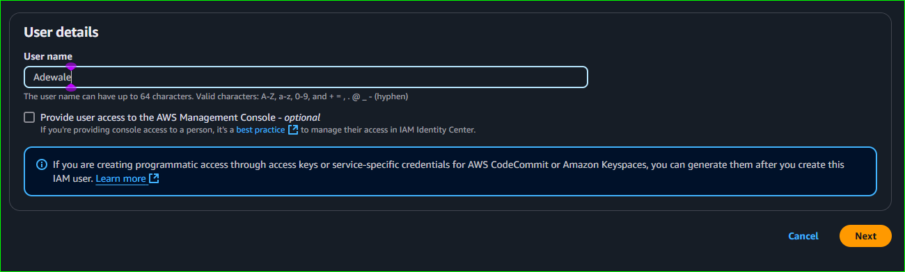

- click on next and follow the steps as shown in these images beloe

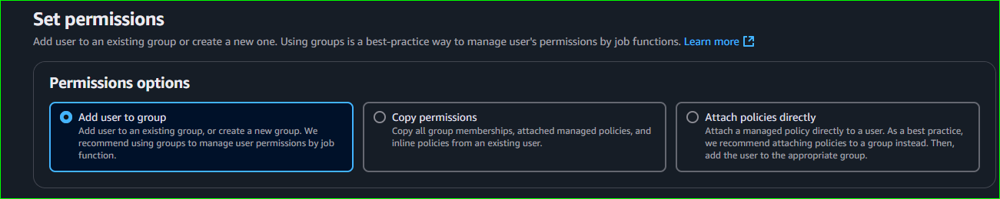

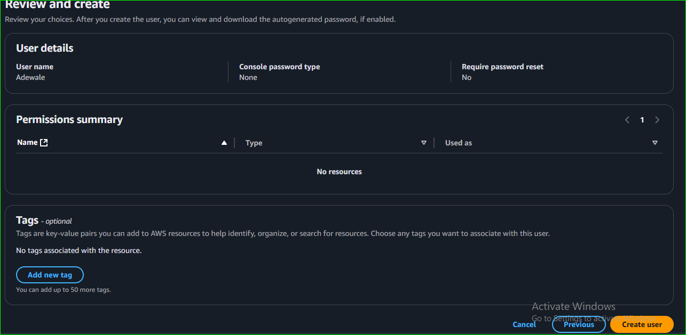

- To grant the just created user console access, navigate to security credetials and click on enable console access

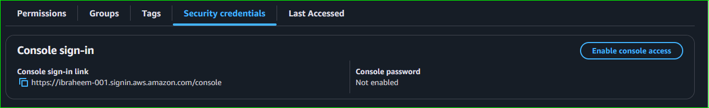
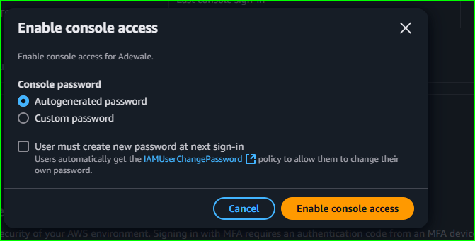
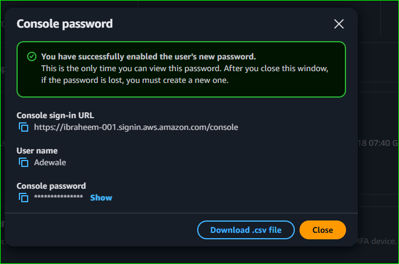

- copy the url,username and the password safe somewhere
- paste the url on your browser, input the username and the password, and click on sign in

- 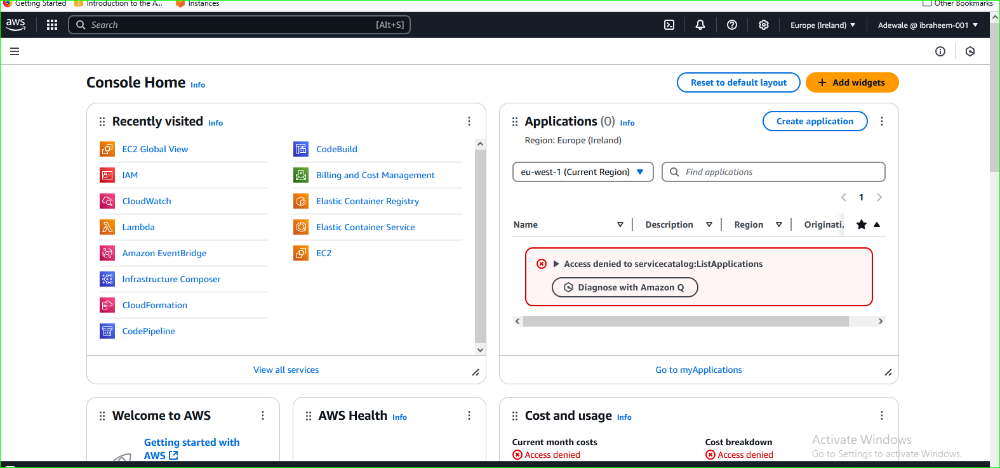

- by default, AWS does not provide permission to the user created, we can verify this by trying to access any service on AWS, for instance, lets try and list the IAM users with this account

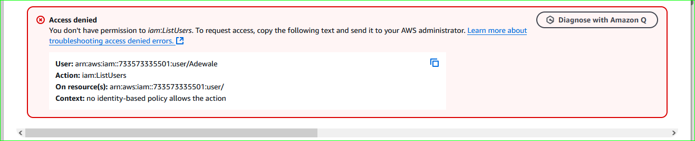

- Now, I want to grant my user the permission to be able to perform all operations on s3 bucket, like listing the buckets, viewing the objects inside the buckets and so on.

- To do this, click on policies under IAM,you will see a list of AWS managed policies, but click on create policy 
- 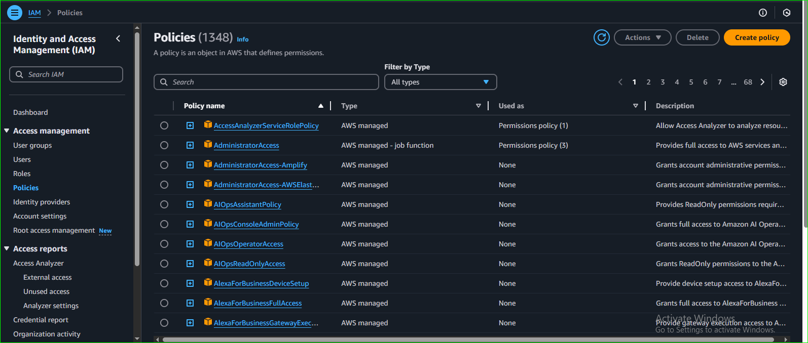
- click on JSON, and edit the json as shown below
- 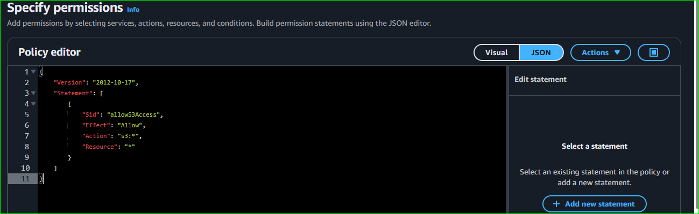

- click on create policy
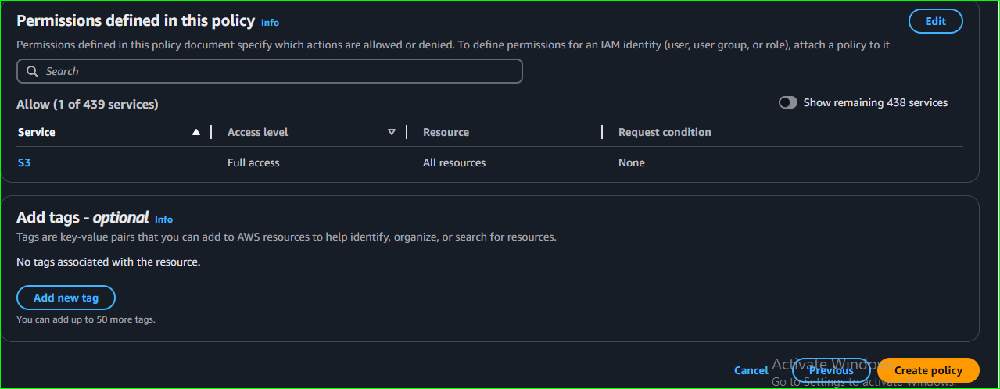

- next step is to assign the just created policy to the IAM user, this can be done by loggin using root user
- To do this, navigate to users, click on the user created, click on add permission,then choose attach policies directly

- click on the policy you created and click on next button

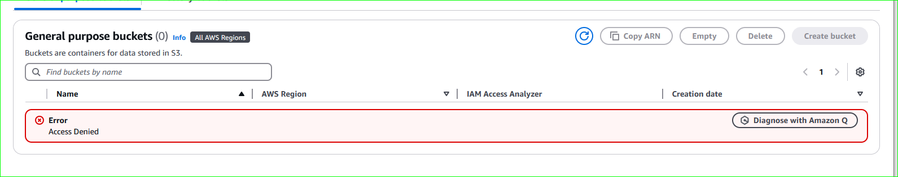

to double sure that this user does not have access to perform any operation on S3 befor, I will try and access s3 bucket again

- review your configurstion, and click on add permission
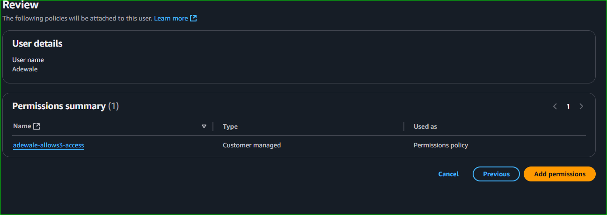

- then try and  list names s3 bucket using IAM user, and we would be able to do so.
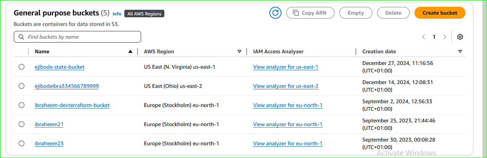

### CREATING IAM GROUP

- Click on user groups under IAM using root user account, click on create group

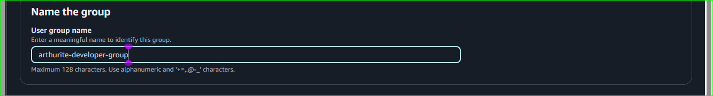

- then check the box, to add the user 'Adewale' that was just created to the group

- Attach the policy just created to it,then click on create user group